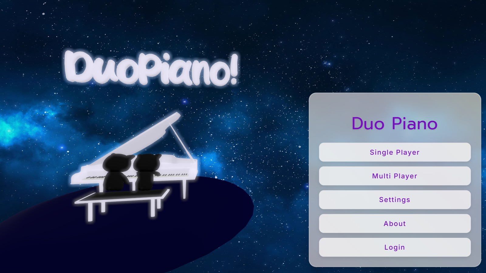
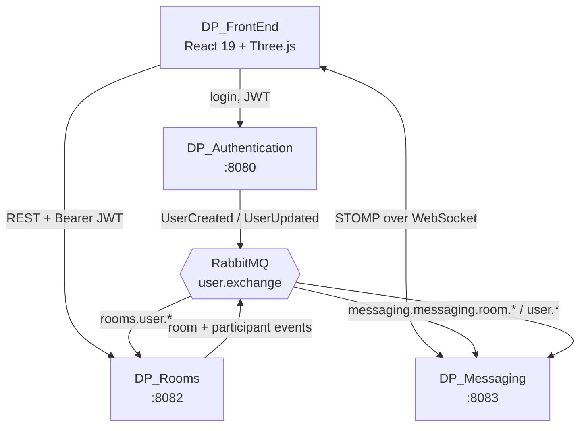
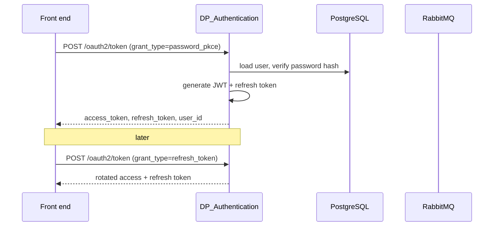

# DP_Authentication

**A real-time collaborative 3D piano — play together in the browser.**



🎹 **[Try it live →](https://duopiano.masemharuspex.com/)**

[](https://github.com/mkepg/DP_Authentication/actions/workflows/ci.yml)


---

## The system

Duo Piano is four services. This repo is the authorization server.



Rooms and Messaging never call Auth on the request path. Each keeps a local
read-model projection of users (and, in Messaging, of rooms) built from
RabbitMQ events, and validates incoming JWTs against Auth's public keys. A
slow or restarting auth service cannot stall a piano session.

| Repo | Role | Port |
|---|---|---|
| **DP_Authentication** ← you are here | OAuth2 authorization server, user identity | 8080 |
| [DP_Rooms](https://github.com/masem-haruspex/DP_Rooms) | Room lifecycle, participants, moderation | 8082 |
| [DP_Messaging](https://github.com/masem-haruspex/DP_Messaging) | Realtime messaging and live key events | 8083 |
| [DP_FrontEnd](https://github.com/masem-haruspex/DP_FrontEnd) | React 19 + React Three Fiber client | — |

## What this service does

- Issues and validates JWT access tokens for the whole system
- A **custom `password_pkce` OAuth2 grant** — direct username/password login for a public SPA, with PKCE still enforced
- **Google and Facebook** social login via `spring-boot-starter-oauth2-client`
- Publishes `UserCreatedEvent` and `UserUpdatedEvent` to RabbitMQ so downstream services stay in sync
- Per-endpoint rate limiting backed by Caffeine
- Correlation IDs threaded through every request for traceable logs

### Why a custom grant

A browser SPA is a public client: it cannot hold a secret, so PKCE is required. But
the product also wants a plain username/password form with no redirect round-trip.
The standard `password` grant was removed in OAuth 2.1 and does not carry PKCE.

`password_pkce` fills that gap — it takes credentials directly but still requires a
`code_verifier`, so a stolen request body alone is not replayable. It is implemented
as a first-class `AuthenticationProvider`, so Spring Authorization Server issues the
tokens through its own configured generators rather than anything bespoke:

```
PasswordPkceGrantAuthenticationConverter   parses the /oauth2/token request
PasswordPkceGrantAuthenticationToken       carries username, password, code_verifier
PasswordPkceGrantAuthenticationProvider    authenticates and issues tokens
```

### Login flow



Registration publishes a `UserCreatedEvent` to `user.exchange`, which is how
DP_Rooms and DP_Messaging learn the user exists without ever querying this service.

## Endpoints

| Method | Path | Purpose |
|---|---|---|
| `POST` | `/oauth2/token` | Token issuance — `password_pkce`, `authorization_code`, `refresh_token` |
| `POST` | `/api/auth/register` | Create an account |
| `PUT` | `/api/auth/{userId}` | Update username or keyboard preference |
| `GET` | `/userinfo` | Current user from the bearer token |
| `GET` | `/api/csrf` | CSRF token for form flows |
| `GET` | `/oauth-success` | Social-login landing page that hands tokens to the popup opener |

Interactive API docs at `/swagger-ui.html`.

## Access token claims

| Claim | Value |
|---|---|
| `sub` | User UUID |
| `user_id` | User UUID |
| `username` | Canonical username |
| `email` | Email address |
| `preferred_keyboard` | `Casio` or `Midiplus` |

DP_Rooms and DP_Messaging authenticate requests from `sub` and `username`.

## Adapting this service to another project

This is deliberately close to a general-purpose auth service. The OAuth2 server,
the `password_pkce` grant, social login, rate limiting, correlation IDs and event
publishing carry no piano-specific logic.

There is exactly one domain seam: the `KeyboardModel` enum and the
`preferredKeyboard` attribute. To reuse this elsewhere, replace it with your own
profile attribute or drop it. It appears in:

`model/KeyboardModel.java` · `model/User.java` · `response/UserResponse.java` ·
`request/UpdateUserRequest.java` · `event/UserCreatedEvent.java` ·
`event/UserUpdatedEvent.java` · `service/AuthService.java` ·
`controller/AuthController.java` · `controller/UserInfoController.java` ·
`controller/OAuthSuccessController.java` ·
`config/AuthorizationServerBeansConfig.java` (token claims) ·
`oauth2/PasswordPkceGrantAuthenticationProvider.java` · and the
`preferred_keyboard` column.

## Quick start

Needs **Java 17+**, **PostgreSQL**, and **RabbitMQ**.

```bash
createdb dp_authentication

cp src/main/resources/application.properties.example \
   src/main/resources/application.properties
# then fill in the values below

./mvnw spring-boot:run
```

| Setting | Purpose |
|---|---|
| `DATABASE_USERNAME` / `DATABASE_PASSWORD` | PostgreSQL credentials |
| `GOOGLE_CLIENT_ID` / `GOOGLE_CLIENT_SECRET` | Google login — omit to disable |
| `FACEBOOK_CLIENT_ID` / `FACEBOOK_CLIENT_SECRET` | Facebook login — omit to disable |
| `RABBITMQ_USERNAME` / `RABBITMQ_PASSWORD` | Defaults to `guest` / `guest` |
| `FRONTEND_URL` | Allowed CORS origin and OAuth redirect target |

`spring.jpa.hibernate.ddl-auto=validate`, so the schema must already exist —
Hibernate will not create it for you.

Actuator binds separately to `127.0.0.1:9000`, so health and metrics are never
exposed on the public port. Helper scripts: `actuator-get-log-level.sh`,
`actuator-set-log-level.sh`, `actuator-monitor-errors.sh`,
`performance-analysis.sh`.

## Known limitations

- `InMemoryOAuth2AuthorizationService` — issued tokens do not survive a restart.
  A `JdbcOAuth2AuthorizationService` would fix this and needs a schema migration.
- `InMemoryRegisteredClientRepository` with a single client (`internal-client`),
  configured at startup rather than stored.
- Test coverage is a context-load test only. There are no unit or integration
  tests for the custom grant.

## Status

A personal project, currently live. All rights reserved — this repository is
published to be read, not reused or redistributed.
